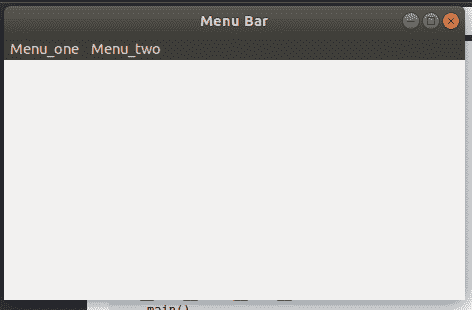
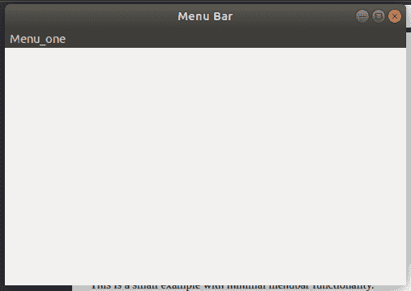

# wxPython–wx 中的 Remove()函数。菜单栏

> 原文:[https://www . geesforgeks . org/wxpython-remove-function-in-wx-menu bar/](https://www.geeksforgeeks.org/wxpython-remove-function-in-wx-menubar/)

在本文中，我们将学习 wx 的 Remove()函数。菜单栏类。Remove()函数将菜单从框架中菜单栏的特定位置移除。该函数采用位置参数，即要删除的菜单位置。

**参数:**

| 参数 | 输入类型 | 描述 |
| --- | --- | --- |
| 刷卡机 | （同 Internationalorganizations）国际组织 | 菜单栏中新菜单的位置 |

**代码:**
让我们在菜单栏`Menu_one`和`Menu_two`中创建一个包含两个菜单的窗口。

## 蟒蛇 3

```
import wx

class Example(wx.Frame):

    def __init__(self, *args, **kw):
        super(Example, self).__init__(*args, **kw)

        # create MenuBar using MenuBar() function
        menubar = wx.MenuBar()

        # add menu to MenuBar
        fm1 = wx.Menu()
        fileitem = fm1.Append(20, "one")

        fm2 = wx.Menu()
        fileitem2 = fm2.Append(20, "two")

        menubar.Append(fm1, '&Menu_one')
        menubar.Append(fm2, '&Menu_two')
        self.SetMenuBar(menubar)
        self.SetSize((300, 200))
        self.SetTitle('Menu Bar')

def main():
    app = wx.App()
    ex = Example(None)
    ex.Show()
    app.MainLoop()

if __name__ == '__main__':
    main()
```

**Output :**

**代码:**
我们写一个代码从菜单栏中移除 Menu_two。

## 蟒蛇 3

```
import wx

class Example(wx.Frame):

    def __init__(self, *args, **kw):
        super(Example, self).__init__(*args, **kw)

        # create MenuBar using MenuBar() function
        menubar = wx.MenuBar()

        # add menu to MenuBar
        fm1 = wx.Menu()
        fileitem = fm1.Append(20, "one")

        fm2 = wx.Menu()
        fileitem2 = fm2.Append(20, "two")
        menubar.Append(fm1, '&Menu_one')
        menubar.Append(fm2, '&Menu_two')
        self.SetMenuBar(menubar)
        self.SetSize((300, 200))
        self.SetTitle('Menu Bar')

        # removing Menu_two from menubar
        menubar.Remove(1)

def main():
    app = wx.App()
    ex = Example(None)
    ex.Show()
    app.MainLoop()

if __name__ == '__main__':
    main()
```

**输出:**

