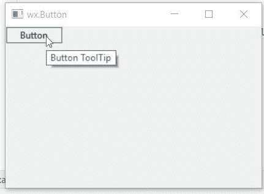

# wxPython–设置按钮的工具提示

> 原文:[https://www . geesforgeks . org/wxpython-set-tooltip-for-button/](https://www.geeksforgeeks.org/wxpython-set-tooltip-for-button/)

在本文中，我们将学习如何为按钮分配工具提示。为了分配工具提示，我们使用了与 wx 关联的 SetToolTip()函数。wxPython 的按钮类。函数的作用是:接受一个字符串参数作为工具提示。

> **语法:** wx。按钮。设置工具提示(自身，字符串)
> 
> **参数:**
> 
> | 参数 | 输入类型 | 描述 |
> | --- | --- | --- |
> | 线 | 线 | 工具提示的字符串。 |

**代码示例:**

```
import wx

class Example(wx.Frame):

    def __init__(self, *args, **kwargs):
        super(Example, self).__init__(*args, **kwargs)
        self.InitUI()

    def InitUI(self):
        self.locale = wx.Locale(wx.LANGUAGE_ENGLISH)

        # create parent panel
        self.pnl = wx.Panel(self)

        # create button at point (20, 20)
        self.btn = wx.Button(self.pnl, id = 1, label ="Button")

        # set tooltip for button
        self.btn.SetToolTip("Button ToolTip")

        self.SetSize((350, 250))
        self.SetTitle('wx.Button')
        self.Centre()

def main():
    app = wx.App()
    ex = Example(None)
    ex.Show()
    app.MainLoop()

if __name__ == '__main__':
    main()
```

**输出窗口**
