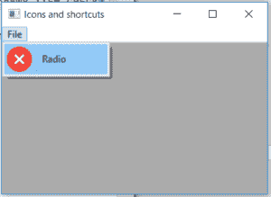

# wx python–wx 中的 SetBitmaps()函数。MenuItem

> 原文:[https://www . geesforgeks . org/wxpython-set bitms-function-in-wx-menuitem/](https://www.geeksforgeeks.org/wxpython-setbitmaps-function-in-wx-menuitem/)

在本文中，我们将学习与 wx 相关联的 SetBitmaps()函数。wxPython 的 MenuItem 类。函数的作用是:为菜单项设置选中/未选中的位图。第一个位图也用作不可检查菜单项的单一位图。
取两个位图作为菜单项选中和未选中状态的参数。

> **语法:**
> 
> ```py
> wx.MenuItem.SetBitmaps(self, checked, unchecked=NullBitmap)
> 
> ```
> 
> **参数:**
> 
> | 参数 | 输入类型 | 描述 |
> | --- | --- | --- |
> | 检查 | wx(地名)。点阵图(Bitmap) | 检查时为菜单项设置的位图。 |
> | 未加抑制的 | wx(地名)。点阵图(Bitmap) | 取消选中时为菜单项设置的位图。 |

**代码示例:**

```py
import wx

class Example(wx.Frame):

    def __init__(self, *args, **kwargs):
        super(Example, self).__init__(*args, **kwargs)

        self.InitUI()

    def InitUI(self):
        self.locale = wx.Locale(wx.LANGUAGE_ENGLISH)
        self.menubar = wx.MenuBar()
        self.fileMenu = wx.Menu()
        self.item = wx.MenuItem(self.fileMenu, 1, '&Radio', helpString ="Check Help", kind = wx.ITEM_CHECK)
        # set bitmap for tool for checked and unchecked status
        self.item.SetBitmaps(checked = wx.Bitmap('right.png'), unchecked = wx.Bitmap('wrong.png'))
        self.fileMenu.Append(self.item)
        self.menubar.Append(self.fileMenu, '&File')
        self.SetMenuBar(self.menubar)
        self.SetSize((350, 250))
        self.SetTitle('Icons and shortcuts')
        self.Centre()

def main():
    app = wx.App()
    ex = Example(None)
    ex.Show()
    app.MainLoop()

if __name__ == '__main__':
    main()
```

**输出:**
*勾选:*


*未勾选:*
