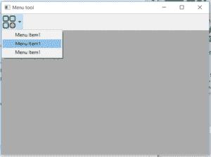
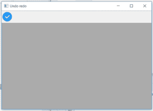
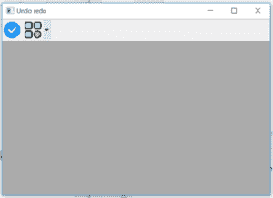

# wx 中的 wxPython | SetDropdownMenu()函数。工具栏

> 原文:[https://www . geeksforgeeks . org/wxpython-setdropbowmenu-function-in-wx-toolbar/](https://www.geeksforgeeks.org/wxpython-setdropdownmenu-function-in-wx-toolbar/)

在本文中，我们将学习与 wx 相关联的 SetDropdownMenu()函数。wxPython 的工具栏类。SetDropdownMenu()函数为其 id 给出的工具设置下拉菜单。工具本身会在不再需要时删除菜单。仅在 GTK+和 MSW 下支持。如果您在程序中定义了一个 EVT _ 工具 _ 下拉()处理程序，您必须调用 wx。事件。跳过它，否则菜单将不会显示。

> **语法:**
> 
> ```
> wx.ToolBar.SetDropdownMenu()
> 
> ```
> 
> **参数:**
> 
> | 参数 | 输入类型 | 描述 |
> | --- | --- | --- |
> | 身份证明（identification） | （同 Internationalorganizations）国际组织 | 传递给添加工具的有问题工具的标识。 |
> | 菜单 | wx 菜单 | 使用特定工具设置的菜单。 |
> 
> **返回类型:**
> 
> ```
> bool
> 
> ```

**代码示例 1:**

```
import wx

class Example(wx.Frame):

    def __init__(self, *args, **kwargs):
        super(Example, self).__init__(*args, **kwargs)
        self.InitUI()

    def InitUI(self):
        self.locale = wx.Locale(wx.LANGUAGE_ENGLISH)
        fileMenu = wx.Menu()
        fileItem = fileMenu.Append(21, 'Menu Item1', 'Item 1')
        fileItem1 = fileMenu.Append(22, 'Menu Item1', 'Item 1')
        fileItem2 = fileMenu.Append(23, 'Menu Item1', 'Item 1')

        self.toolbar = self.CreateToolBar()
        td = self.toolbar.AddTool(1, '', wx.Bitmap('menu.png'), kind = wx.ITEM_DROPDOWN)
        # set dropdown menu with tool id 1
        self.toolbar.SetDropdownMenu(id = 1, menu = fileMenu)
        self.toolbar.Realize()
        self.SetSize((350, 250))
        self.SetTitle('Menu tool')
        self.Centre()

    def OnQuit(self, e):
        self.Close()

def main():

    app = wx.App()
    ex = Example(None)
    ex.Show()
    app.MainLoop()

if __name__ == '__main__':
    main()
```

**输出:**


**代码示例 2:**

```
import wx

class Example(wx.Frame):

    def __init__(self, *args, **kwargs):
        super(Example, self).__init__(*args, **kwargs)
        self.InitUI()

    def InitUI(self):
        self.locale = wx.Locale(wx.LANGUAGE_ENGLISH)
        self.toolbar = self.CreateToolBar()
        td = self.toolbar.AddTool(1, 'right', wx.Bitmap('right.png'))
        self.toolbar.Realize()
        self.Bind(wx.EVT_TOOL, self.OnOne, td)

        self.SetSize((350, 250))
        self.SetTitle('Undo redo')
        self.Centre()

    def OnOne(self, e):
        # INSERT A DROPDOWN TOOL IN TOOLBAR
        self.toolbar.InsertTool(pos = 1, toolId = 2, label ='new', bitmap = wx.Bitmap('menu.png'), kind = wx.ITEM_DROPDOWN)
        # MENU TO BE ADDED TO TOOL
        fileMenu = wx.Menu()
        fileItem = fileMenu.Append(21, 'Menu Item1', 'Item 1')
        fileItem1 = fileMenu.Append(22, 'Menu Item1', 'Item 1')
        fileItem2 = fileMenu.Append(23, 'Menu Item1', 'Item 1')
        # SET DROPDOWN MENU 
        self.toolbar.SetDropdownMenu(id = 2, menu = fileMenu)
        # Realize() called to finalize new added tools
        self.toolbar.Realize()

    def OnQuit(self, e):

        self.Close()

def main():

    app = wx.App()
    ex = Example(None)
    ex.Show()
    app.MainLoop()

if __name__ == '__main__':
    main()
```

**输出:**
*点击前勾选工具:*


*点击勾选工具后:*
