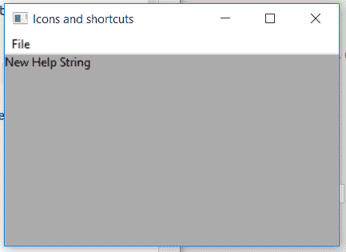

# wx xpython–wx 中的 SetHelp()函数。菜单项

> 原文:[https://www . geesforgeks . org/wxpython-set help-function-in-wx-menuitem/](https://www.geeksforgeeks.org/wxpython-sethelp-function-in-wx-menuitem/)

在本文中，我们将学习与 wx 相关的 SetHelp()函数。wxPython 的 MenuItem 类。SetHelp()函数只是用来设置与菜单项相关联的帮助字符串。SetHelp()函数只接受 helpstring 作为参数。

> **语法:**
> 
> ```py
> wx.MenuItem.SetHelp(self, helpString)
> 
> ```
> 
> **参数:**
> 
> | 参数 | 输入类型 | 描述 |
> | --- | --- | --- |
> | 帮助字符串 | 线 | 要与 menuitem 关联的帮助字符串。 |

**代码示例:**

```py
import wx

class Example(wx.Frame):

    def __init__(self, *args, **kwargs):
        super(Example, self).__init__(*args, **kwargs)

        self.InitUI()

    def InitUI(self):
        self.locale = wx.Locale(wx.LANGUAGE_ENGLISH)
        self.menubar = wx.MenuBar()
        self.fileMenu = wx.Menu()
        self.st = wx.StaticText(self, label ="", pos =(20, 20), 
                                         style = wx.ALIGN_LEFT)
        self.item = wx.MenuItem(self.fileMenu, 1, '&Radio', 
                                      kind = wx.ITEM_CHECK)

        # set help string for menu item
        self.item.SetHelp(helpString ="New Help String")

        # print help string associated with menu item
        help = self.item.GetHelp()

        # set text of st as help string of item
        self.st.SetLabel(help)
        self.fileMenu.Append(self.item)
        self.menubar.Append(self.fileMenu, '&File')
        self.SetMenuBar(self.menubar)
        self.SetSize((350, 250))
        self.SetTitle('Icons and shortcuts')
        self.Centre()

def main():
    app = wx.App()
    ex = Example(None)
    ex.Show()
    app.MainLoop()

if __name__ == '__main__':
    main()
```

**输出:**
