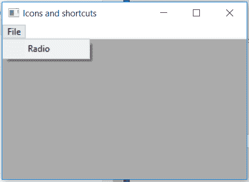

# wx python–set menu()wx 中的函数。MenuItem

> 哎哎哎:# t0]https://www . geeksforgeeks . org/wx python-set menu-function-in-wx-menu item/

在本文中，我们将学习与 wx 相关的 SetMenu()函数。wxPython 的 MenuItem 类。函数的作用是:设置包含该菜单项的父菜单。只需要一个 wx。菜单对象作为参数。

> **语法:**
> 
> ```py
> wx.MenuItem.SetMenu(self, menu)
> 
> ```
> 
> **参数:**
> 
> | 参数 | 输入类型 | 描述 |
> | --- | --- | --- |
> | 菜单 | wx 菜单 | 此项目的父菜单。 |

**代码示例:**

```py
import wx

class Example(wx.Frame):

    def __init__(self, *args, **kwargs):
        super(Example, self).__init__(*args, **kwargs)

        self.InitUI()

    def InitUI(self):
        self.locale = wx.Locale(wx.LANGUAGE_ENGLISH)
        self.menubar = wx.MenuBar()
        self.fileMenu = wx.Menu()
        self.st = wx.StaticText(self, label ="", pos =(20, 20), 
                                         style = wx.ALIGN_LEFT)
        self.item = wx.MenuItem(None, 1, '&Radio', kind = wx.ITEM_CHECK)

        # INITIAL MENU WAS NONE NOW INCLUDE MENUITEM TO self.fileMenu
        self.item.SetMenu(self.fileMenu)
        self.fileMenu.Append(self.item)
        self.menubar.Append(self.fileMenu, '&File')
        self.SetMenuBar(self.menubar)
        self.SetSize((350, 250))
        self.SetTitle('Icons and shortcuts')
        self.Centre()

def main():
    app = wx.App()
    ex = Example(None)
    ex.Show()
    app.MainLoop()

if __name__ == '__main__':
    main()
```

**输出:**
