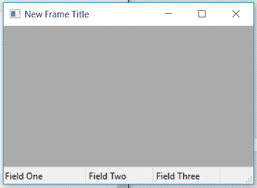

# wx Tyson–wx 中的 SetStatusWidths()函数。状态栏

> 原文:[https://www . geesforgeks . org/wxpython-setstatuswiths-function-in-wx-status bar/](https://www.geeksforgeeks.org/wxpython-setstatuswidths-function-in-wx-statusbar/)

在本文中，我们将学习与 wx 相关联的 SetStatusWidths()函数。wxPython 的 StatuBar 类。函数的作用是:设置状态行中字段的宽度。

有两种类型的字段:固定宽度字段和可变宽度字段。对于固定宽度字段，您应该以像素为单位指定其(恒定)宽度。对于可变宽度字段，请指定一个负数，表示字段应该如何扩展:所有可变宽度字段的剩余空间将根据该数字的绝对值在它们之间进行划分。宽度为-2 的可变宽度字段得到的值是宽度为-1 的字段的两倍，依此类推。

> **语法:** wx。状态栏。设置状态栏(自身，宽度)
> 
> **参数:**
> 
> | 参数 | 输入类型 | 描述 |
> | --- | --- | --- |
> | 宽度 | 国际号码列表 | 要设置的文本。使用空字符串("")清除该字段。 |
> | 我 | （同 Internationalorganizations）国际组织 | 包含 n 个整数的数组，如果是正数，每个整数都是以像素为单位的绝对状态字段宽度，如果是负数，则表示可变宽度字段。特殊值“无”意味着所有字段的宽度应该相同。 |

**代码示例:**

```py
import wx

class Example(wx.Frame):

    def __init__(self, *args, **kwargs):
        super(Example, self).__init__(*args, **kwargs)

        self.InitUI()

    def InitUI(self):

        self.locale = wx.Locale(wx.LANGUAGE_ENGLISH)
        self.statusbar = wx.StatusBar()
        self.statusbar.Create(self, id = 1, name = "Status Bar")
        self.SetStatusBar(self.statusbar)
        self.SetSize((350, 250))

        self.statusbar.SetFieldsCount(3)

        # SET WIDTHS FOR CORRESPONDING FIELD
        self.statusbar.SetStatusWidths([100, 80, 60])        

        # SET TEXT FOR ALL FIELDS
        self.statusbar.SetStatusText("Field One", 0)
        self.statusbar.SetStatusText("Field Two", 1)
        self.statusbar.SetStatusText("Field Three", 2)

        self.SetTitle('New Frame Title')
        self.Centre()
        print(self.statusbar.GetMinHeight())

def main():
    app = wx.App()
    ex = Example(None)
    ex.Show()
    app.MainLoop()

if __name__ == '__main__':
    main()
```

**输出窗口:**
