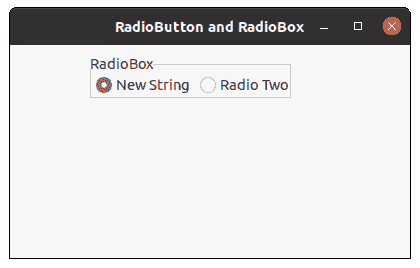

# wx 中的 wxPython–setString()方法。无线电盒

> 原文:[https://www . geesforgeks . org/wxpython-set string-method-in-wx-radio box/](https://www.geeksforgeeks.org/wxpython-setstring-method-in-wx-radiobox/)

在本文中，我们将学习与 wx 相关联的 SetString()方法。wxPython 的 RadioBox 类。SetString()函数只是用来为给定的项目设置标签。SetString()函数是 SetLabel()方法的替代方法。SetString()方法将位置和新字符串作为参数。

> **语法:** wx。RadioBox.SetString(self，n，String)
> 
> **参数**
> 
> | 参数 | 输入类型 | 描述 |
> | --- | --- | --- |
> | n | （同 Internationalorganizations）国际组织 | 从零开始的项索引。 |
> | 线 | 线 | 要设置的标签。 |

**代码示例:**

```
import wx

class FrameUI(wx.Frame):

    def __init__(self, parent, title):
        super(FrameUI, self).__init__(parent, title = title, size =(300, 200))

        # function for in-frame components
        self.InitUI()

    def InitUI(self):
        # parent panel for radio box
        pnl = wx.Panel(self)

        # list of choices
        lblList = ['Radio One', 'Radio Two']

        # create radio box containing above list
        self.rbox = wx.RadioBox(pnl, label ='RadioBox', pos =(80, 10), choices = lblList,
                                         majorDimension = 1, style = wx.RA_SPECIFY_ROWS)

        # change string label
        self.rbox.SetString(0, "New String")

        # set frame in centre
        self.Centre()
        # set size of frame
        self.SetSize((400, 250))
        # show output frame
        self.Show(True)

# wx App instance
ex = wx.App()
# Example instance
FrameUI(None, 'RadioButton and RadioBox')
ex.MainLoop()
```

**输出窗口:**
