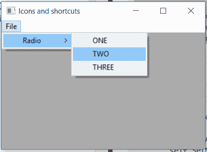

# wx python–setsubmenu()wx 中的函数。MenuItem

> 原文:[https://www . geeksforgeeks . org/wxpython-set subbox-function-in-wx-menuitem/](https://www.geeksforgeeks.org/wxpython-setsubmenu-function-in-wx-menuitem/)

在本文中，我们将学习与 wx 相关联的 setsubscribe()函数。wxPython 的 MenuItem 类。setsubscribe()只是用来设置这个菜单项的子菜单。

它只需要一个参数，那就是 wx。要为项目添加子菜单的菜单。

> **语法:**
> 
> ```py
> wx.MenuItem.SetSubMenu(self, menu)
> 
> ```
> 
> **参数:**
> 
> | 参数 | 输入类型 | 描述 |
> | --- | --- | --- |
> | 菜单 | wx 菜单 | 该项目的子菜单。 |

**代码示例:**

```py
import wx

class Example(wx.Frame):

    def __init__(self, *args, **kwargs):
        super(Example, self).__init__(*args, **kwargs)

        self.InitUI()

    def InitUI(self):
        self.locale = wx.Locale(wx.LANGUAGE_ENGLISH)
        self.menubar = wx.MenuBar()
        self.fileMenu = wx.Menu()
        # CREATE MENU 
        self.submenu = wx.Menu()
        self.submenu.Append(wx.ID_ANY, 'ONE')
        self.submenu.Append(wx.ID_ANY, 'TWO')
        self.submenu.Append(wx.ID_ANY, 'THREE')
        self.st = wx.StaticText(self, label ="", pos =(20, 20), 
                                         style = wx.ALIGN_LEFT)
        self.item = wx.MenuItem(None, 1, '&Radio', kind = wx.ITEM_CHECK)

        # SET self.submenu AS SUBMENU FOR self.item MENUITEM
        self.item.SetSubMenu(self.submenu)
        self.fileMenu.Append(self.item)
        self.menubar.Append(self.fileMenu, '&File')
        self.SetMenuBar(self.menubar)
        self.SetSize((350, 250))
        self.SetTitle('Icons and shortcuts')
        self.Centre()

def main():
    app = wx.App()
    ex = Example(None)
    ex.Show()
    app.MainLoop()

if __name__ == '__main__':
    main()
```

**输出:**
