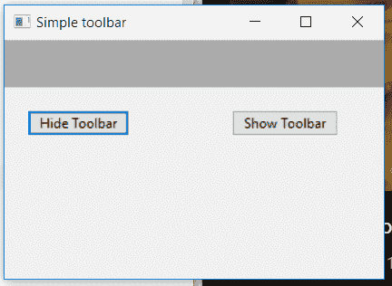
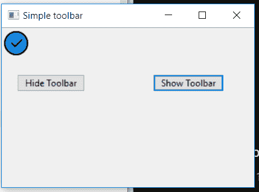

# wxPython–在框架中显示隐藏工具栏

> 原文:[https://www . geesforgeks . org/wxpython-show-hidden-画框工具栏/](https://www.geeksforgeeks.org/wxpython-show-hidden-toolbar-in-the-frame/)

在本文中，我们将学习如何显示隐藏的工具栏。为了取消隐藏/显示工具栏，我们可以使用显示()功能。Show()函数可以用来显示和隐藏工具栏。函数的作用是:显示布尔参数，如果为真，显示窗口。否则，隐藏它。

> **语法:** wx。工具栏。显示(自我，显示=真)
> 
> **参数:**
> 
> | 参数 | 输入类型 | 描述 |
> | --- | --- | --- |
> | 显示 | 弯曲件 | 如果为真，则显示窗口。否则，隐藏它。 |
> 
> **返回类型:** bool
> 
> **返回:**如果窗口已显示或隐藏，则为真；如果由于窗口已处于请求状态而未执行任何操作，则为假。

**代码示例:**

```
import wx

class Example(wx.Frame):
    global count
    count = 0;

    def __init__(self, *args, **kwargs):
        super(Example, self).__init__(*args, **kwargs)

        self.InitUI()

    def InitUI(self):
        self.locale = wx.Locale(wx.LANGUAGE_ENGLISH)
        self.toolbar = self.CreateToolBar()
        tool = self.toolbar.AddTool(wx.ID_ANY, 'First', 
                                  wx.Bitmap('right.png'))
        self.toolbar.Realize()

        # panel for button
        self.pnl = wx.Panel(self)

        # button to hide toolbar
        self.btn = wx.Button(self.pnl, label ='Hide Toolbar', pos =(20, 20))

        # button to show toolbar
        self.btn2 = wx.Button(self.pnl, label ='Show Toolbar', pos =(200, 20))

        # bind event with hide button
        self.btn.Bind(wx.EVT_BUTTON, self.onclickhide)

        # bind event with show button
        self.btn2.Bind(wx.EVT_BUTTON, self.onclickshow)

        self.SetSize((350, 250))
        self.SetTitle('Simple toolbar')
        self.Centre()

    def onclickhide(self, e):
        # hide toolbar
        self.toolbar.Hide()

    def onclickshow(self, e):
        # hide toolbar
        self.toolbar.Show(True)

def main():
    app = wx.App()
    ex = Example(None)
    ex.Show()
    app.MainLoop()

if __name__ == '__main__':
    main()
```

**输出窗口:**

*点击进入按钮*前


*后点击按钮*