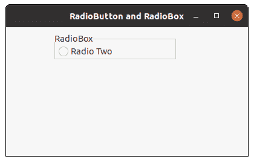

# wx 中的 wxPython–show item()方法。无线电盒

> 原文:[https://www . geesforgeks . org/wxpython-showitem-method-in-wx-radio box/](https://www.geeksforgeeks.org/wxpython-showitem-method-in-wx-radiobox/)

在本文中，我们将学习与 wx 相关联的 ShowItem()方法。wxPython 的 RadioBox 类。ShowItem()方法是一个简单的方法，用于显示或隐藏单个按钮。

如果项目已经显示或隐藏，则 ShowItem()方法返回 True 如果因为项目已经处于请求的状态而没有执行任何操作，则返回 False。

> **语法:** wx。单选框。显示项目(自身，项目，显示=真)
> 
> **参数**
> 
> | 参数 | 输入类型 | 描述 |
> | --- | --- | --- |
> | 项目 | （同 Internationalorganizations）国际组织 | 要显示或隐藏的按钮从零开始的位置。 |
> | 显示 | 弯曲件 | 真的显示，假的隐藏。 |
> 
> **返回类型:** bool
> 
> **返回:**如果项目已被显示或隐藏，则为真；如果因为项目已处于请求状态而未执行任何操作，则为假。

**代码示例:**

```py
import wx

class FrameUI(wx.Frame):

    def __init__(self, parent, title):
        super(FrameUI, self).__init__(parent, title = title, size =(300, 200))

        # function for in-frame components
        self.InitUI()

    def InitUI(self):
        # parent panel for radio box
        pnl = wx.Panel(self)

        # list of choices
        lblList = ['Radio One', 'Radio Two']

        # create radio box containing above list
        self.rbox = wx.RadioBox(pnl, label ='RadioBox', pos =(80, 10), choices = lblList,
                                          majorDimension = 1, style = wx.RA_SPECIFY_ROWS)

        # hide item at position 0
        self.rbox.ShowItem(0, False)

        # set frame in centre
        self.Centre()
        # set size of frame
        self.SetSize((400, 250))
        # show output frame
        self.Show(True)

# wx App instance
ex = wx.App()
# Example instance
FrameUI(None, 'RadioButton and RadioBox')
ex.MainLoop()
```

**输出窗口:**
