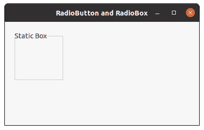

# wxPython 静态箱

> 原文:[https://www.geeksforgeeks.org/wxpython-static-box/](https://www.geeksforgeeks.org/wxpython-static-box/)

在本文中，我们将学习 wxPython 中的静态盒子。静态框是围绕其他窗口绘制的矩形，用于表示项目的逻辑分组。
请注意，虽然以前的版本要求出现在静态框内的窗口被创建为其兄弟窗口(即使用与静态框本身相同的父窗口)，但是由于 wxWidgets 2.9.1，也可以将它们创建为 wx 的子窗口。StaticBox 本身，如果与以前版本的兼容性不重要，实际上鼓励您这样做。

> **语法:** wx。static cbox . static cbox(parent，id=ID_ANY，label= " "，pos=DefaultPosition，size=DefaultSize，style=0，name=staticboxnamestr)
> 
> **参数**
> 
> | 参数 | 输入类型 | 描述 |
> | --- | --- | --- |
> | 父母 | wx。窗户 | 父窗口。不得为无。 |
> | 身份证明（identification） | wx.窗口标识 | 窗口标识符。值 wx。标识 _ 任意表示默认值。 |
> | 标签 | 线 | 要在静态框中显示的文本，空字符串表示没有标签。 |
> | 刷卡机 | wx。要点 | 窗口位置。如果 wx。如果指定了默认位置，则选择默认位置。 |
> | 大小 | wx。大小 | 复选框大小。如果 wx。如果指定了默认大小，则选择默认大小。 |
> | 风格 | 长的 | 窗口样式。没有特定于静态框的样式，但是在使用 wxGTK 时，可以在这里使用通用的 ALIGN_LEFT、ALIGN _ CENTRE _ HORIZONTAL 和 ALIGN_RIGHT 来更改静态框标签的位置 |
> | 名字 | 线 | 窗口名称 |

**代码示例:**

```py
import wx

class FrameUI(wx.Frame):

    def __init__(self, parent, title):
        super(FrameUI, self).__init__(parent, title = title, size =(300, 200))

        # function for in-frame components
        self.InitUI()

    def InitUI(self):
        # parent panel for radio box
        pnl = wx.Panel(self)

        # create static box
        self.sb = wx.StaticBox(pnl, 2, label ="Static Box",
                             pos =(20, 20), size =(100, 100))

        # set frame in centre
        self.Centre()
        # set size of frame
        self.SetSize((400, 250))
        # show output frame
        self.Show(True)

# wx App instance
ex = wx.App()
# Example instance
FrameUI(None, 'RadioButton and RadioBox')
ex.MainLoop()
```

**输出窗口:**
